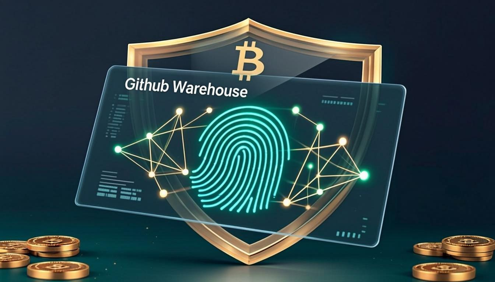
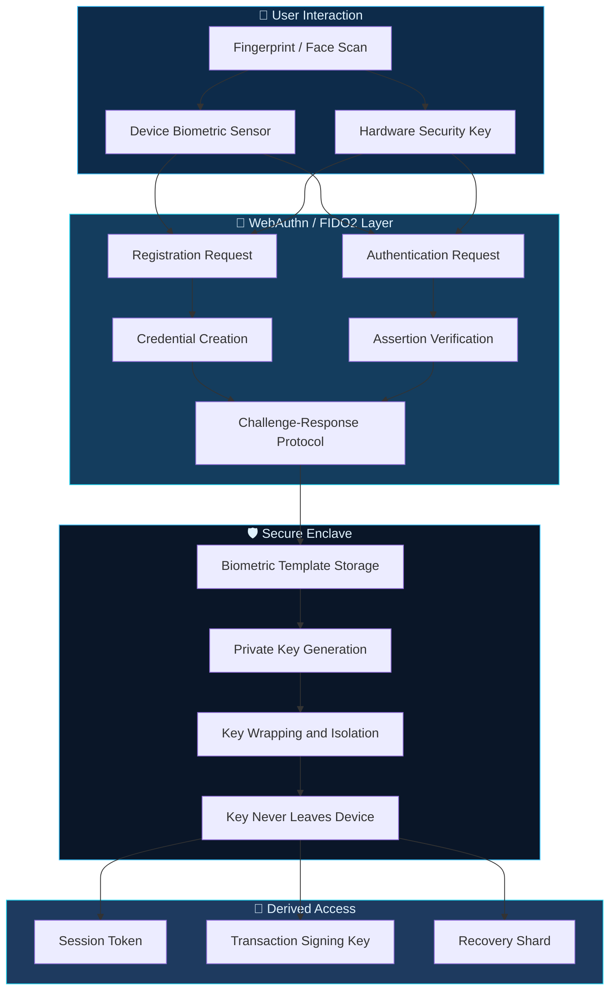
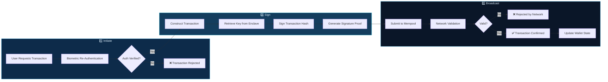
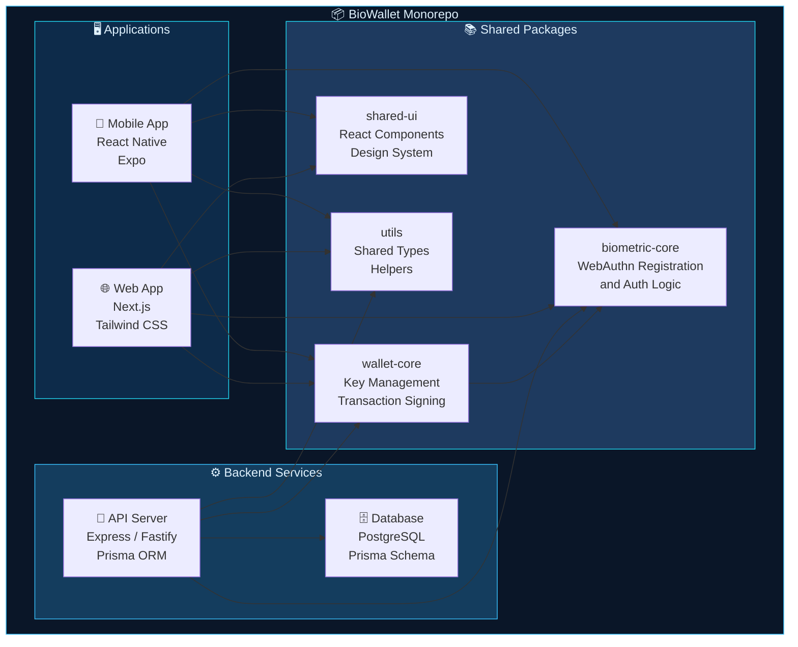
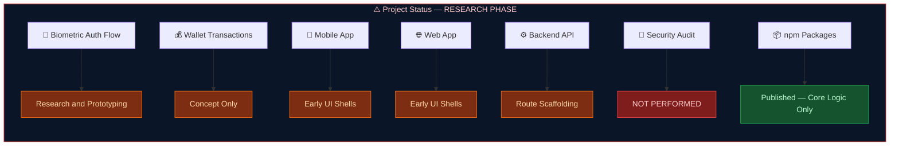

<div align="center">
  <a href="https://git.io/typing-svg">
    
  </a>
</div>

<br/>

<div align="center">

[](https://www.typescriptlang.org/)
[](https://webauthn.io/)
[](https://ethereum.org/)
[](./LICENSE)

</div>

---

## Overview

**BioWallet** is a concept wallet that explores the intersection of biometric authentication and cryptocurrency management. Leveraging the WebAuthn (FIDO2) standard, BioWallet aims to replace traditional seed phrases and private key management with device-level biometric authentication — your fingerprint, face, or security key becomes the gateway to your crypto assets.

This is an early-stage research project investigating whether biometric auth can improve the UX and security of crypto wallets without compromising the self-custody principles that make crypto valuable.

## Features

### Biometric Authentication
- WebAuthn/FIDO2-based authentication flow
- Fingerprint and facial recognition support (device-dependent)
- Hardware security key integration (YubiKey, etc.)
- Multi-factor authentication combining biometric + PIN

### Wallet Management
- Create and manage multiple crypto wallets
- Send and receive transactions
- Token and NFT portfolio tracking
- Transaction history and analytics

### Security Architecture
- Private keys never leave the device's secure enclave
- Biometric template stored only on authenticator device
- Optional social recovery mechanism
- Session-based access with automatic timeout

### User Experience
- No seed phrases to memorize or store
- One-tap transaction signing with biometric verification
- Clean, intuitive wallet interface
- Cross-device sync (with re-authentication)

### Developer API
- Extensible authentication provider system
- WebAuthn credential management API
- Transaction builder and signer interface
- Plugin architecture for chain support

## Honest Notes

> **Important limitations to understand:**

- **Early Development** — This project is in early development and is **not production-ready** for storing real funds. The authentication flows, key management, and security model are still being validated.
- **Not for Real Funds** — Do not use BioWallet with significant amounts of cryptocurrency. It has not undergone formal security audits and may contain vulnerabilities.
- **Device Dependency** — Biometric authentication relies entirely on device support. If your device doesn't support WebAuthn or biometric sensors, you cannot use the core authentication feature. Loss of the device means loss of access unless recovery mechanisms are configured.
- **Trade-Offs** — Biometric auth introduces a different threat model than seed phrases. While it eliminates seed phrase theft, it introduces device-dependent risks (device loss, biometric spoofing, secure enclave vulnerabilities).
- **No Security Audit** — This project has not been audited by a professional security firm. Use for experimentation and learning only.

## Visual Architecture

### Biometric Authentication Flow



### Wallet Transaction Pipeline



### Monorepo Architecture



### Project Status Dashboard



> **Honest Assessment:** BioWallet is an early-stage research project. The npm packages contain scaffolding and type definitions, not battle-tested crypto implementations. The biometric auth flows are conceptual and have not been validated by security professionals. **Do not use with real funds.**

---

## Quick Start

### Prerequisites
- Node.js 18+
- A browser/device that supports WebAuthn
- Biometric sensor or hardware security key

### Installation

```bash
git clone https://github.com/mulkymalikuldhrs/BioWallet.git
cd BioWallet

# Install dependencies

<!-- AUTO-PACKAGE-BADGES:START -->
<!-- Auto-generated package badges -->

   [](https://www.npmjs.com/package/biometric-core)
   [](https://www.npmjs.com/package/shared-ui)
   [](https://www.npmjs.com/package/utils)
   [](https://www.npmjs.com/package/wallet-core)

<!-- AUTO-PACKAGE-BADGES:END -->
npm install

# Configure environment
cp .env.example .env
```

### Configuration

```env
NEXT_PUBLIC_APP_URL=http://localhost:3000
DATABASE_URL=your_database_url
WEBAUTHN_RP_ID=localhost
WEBAUTHN_RP_NAME=BioWallet
```

### Running

```bash
# Development
npm run dev

# Production
npm run build && npm start
```

## Project Structure

```
BioWallet/
├── src/
│   ├── app/              # Application routes
│   ├── components/
│   │   ├── wallet/       # Wallet UI components
│   │   ├── auth/         # Authentication screens
│   │   └── portfolio/    # Asset tracking views
│   ├── lib/
│   │   ├── webauthn/     # WebAuthn registration & auth
│   │   ├── crypto/       # Key management & signing
│   │   ├── chains/       # Blockchain interaction
│   │   └── recovery/     # Social recovery logic
│   └── types/            # TypeScript definitions
├── tests/                # Test suites
└── docs/                 # Architecture & security docs
```

## Contributing

Contributions are especially welcome in:

1. **Security review** — Identifying vulnerabilities in the auth flow
2. **Chain support** — Adding new blockchain integrations
3. **Recovery mechanisms** — Improving key recovery options
4. **Testing** — Adding comprehensive test coverage

Please open an issue to discuss major changes before submitting PRs.

## Disclaimer

**BioWallet is experimental software and not suitable for storing real cryptocurrency funds.** It has not been security audited. The biometric authentication model is a concept under active research. Do not rely on this wallet for any funds you cannot afford to lose. The authors assume no liability for any loss of funds or data.

## License

This project is licensed under the **MIT License** — see the [LICENSE](./LICENSE) file for details.

## Author

<div align="center">

**Mulky Malikul Dhaher**

[](https://github.com/mulkymalikuldhrs)
[](mailto:mulkymalikudhr@mail.com)

</div>

---


